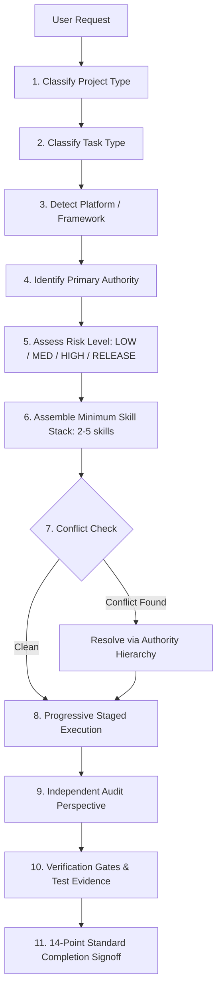

<div align="center">

# 🧰 Bundle Useful Skills (`bundle-useful-skills`)

**Production-grade, zero-dependency Agent Skills router, cryptographic lockfile registry, and focused bundle orchestrator for high-assurance software engineering.**

[](https://github.com/ammasyaa/bundle-useful-skills/actions/workflows/ci.yml)
[](https://www.python.org/)
[](./bundles)
[](./registry/skills.json)
[](./CREDITS.md)
[-informational.svg)](./router)
[](./SECURITY.md)
[](./LICENSE)

<p align="center">
  <a href="#-fast--frictionless-installation">Installation</a> •
  <a href="#-verifying-skill-detection-in-your-agentic-app">Detection & Doctor</a> •
  <a href="#-why-bundle-useful-skills">Why This Exists</a> •
  <a href="#-the-11-step-routing-pipeline">Routing Architecture</a> •
  <a href="#-the-17-focused-bundles-bus-">The 17 Bundles</a> •
  <a href="#-domain-profiles">Domain Profiles</a> •
  <a href="#%EF%B8%8F-authority-hierarchy--conflict-matrix">Authority & Conflicts</a> •
  <a href="#-cli-reference--examples">CLI Reference</a> •
  <a href="#%EF%B8%8F-supply-chain-security--admission-pipeline">Security & Governance</a>
</p>

---

</div>

## ⚡ Fast & Frictionless Installation

`bundle-useful-skills` requires **zero third-party dependencies** and runs out of the box with Python 3.10+. Choose your preferred installation method below:

### Option 1: Universal One-Liner (Fastest & Recommended)

Install the global `bus` CLI and automatically register the router and **all 136 unique skills across all 17 focused bundles** globally into all detected AI agents on your machine with one command:

**macOS & Linux:**
```bash
curl -fsSL https://raw.githubusercontent.com/ammasyaa/bundle-useful-skills/main/install.sh | bash
```

**Windows (PowerShell):**
```powershell
irm https://raw.githubusercontent.com/ammasyaa/bundle-useful-skills/main/install.ps1 | iex
```

*What this does automatically:*
1. Validates Python 3.10+ availability.
2. Clones or updates the repository into `~/.bundle-useful-skills`.
3. Installs the router and constituent skills (137 total) globally into **Google Antigravity** (`~/.gemini/config/skills`), **Anthropic Claude Code** (`~/.claude/skills`), **OpenAI Codex** (`~/.codex/skills`), **Cursor** (`~/.cursor/skills`), and **Windsurf** (`~/.codeium/windsurf/skills`).
4. Adds the global `bus` command to your PATH (`~/.local/bin/bus`).
5. Executes `bus doctor` to output live confirmation and proof of detection.

---

### Option 2: Global CLI via Pip or Pipx

Install `bundle-useful-skills` globally as a native Python command-line utility:

```bash
# Direct install with pip
pip install git+https://github.com/ammasyaa/bundle-useful-skills.git

# Or isolated application install with pipx
pipx install git+https://github.com/ammasyaa/bundle-useful-skills.git
```

Once installed, the `bus` command is immediately available everywhere in your terminal:
```bash
# Verify agent detection
bus doctor

# Route a prompt to the minimum sufficient skill stack
bus "Build a real-time Next.js dashboard with Supabase"
```

---

### Option 3: 1-Click AI Agent Integration

Already cloned the repository or installed via pip? You can register skills directly with your preferred agent environments:

```bash
# Install all 136 skills + router across all detected agents (Default)
bus --install all --all-skills
# (or: python scripts/install.py --target all --bundle all)

# Install only the lightweight router skill without bundle skills
bus --install all
# (or: python scripts/install.py --target all --router-only)

# Install specifically to Google Antigravity
bus --install antigravity --all-skills

# Install specifically to Anthropic Claude Code
bus --install claude --all-skills

# Install specifically to OpenAI Codex
bus --install codex --all-skills

# Install specifically to Cursor
bus --install cursor --all-skills

# Install specifically to Windsurf
bus --install windsurf --all-skills
```

---

### Option 4: Install a Specific Focused Bundle into Your Agent

Want your agent to possess individual skills from a specific domain bundle (e.g. `bus-web-app-builder`, `bus-product-ui-taste`)? Install it with one flag:

```bash
# Install the Web App Builder bundle into all active agents
bus --install all --install-bundle bus-web-app-builder

# Install the Product UI & Taste bundle into Claude Code
bus --install claude --install-bundle bus-product-ui-taste

# Install all 17 focused bundles into Antigravity
bus --install antigravity --install-bundle all
```

---

### Option 5: Local Clone & Development

```bash
# 1. Clone repository
git clone https://github.com/ammasyaa/bundle-useful-skills.git
cd bundle-useful-skills

# 2. Install editable CLI
pip install -e .

# 3. Verify health across all AI agents
python scripts/install.py --doctor

# 4. Run test suite & validation
python -m unittest discover tests -v
python scripts/validate_registry.py
```

---

## 🩺 Verifying Skill Detection in Your Agentic App

After installation, how do you verify that your AI agents detect and load the skills?

### 1. Instant CLI Health Check (`bus doctor`)

Run the built-in diagnostic doctor command anytime:

```bash
bus doctor
# or: python scripts/install.py --doctor
```

*Sample Output:*
```text
======================================================================
  [DOCTOR] Bundle Useful Skills: Agentic App Detection & Health Check
======================================================================

[DETECTED]   Google Antigravity
  Target Path : ~/.gemini/config/skills
  Status      : 137 skills installed | [ROUTER ACTIVE]
  Sample      : systematic-debugging, test-driven-development, frontend-design, react-best-practices, supabase
  Verify In-App: Restart or start a new Antigravity session. In the chat prompt, check 'Available skills' or ask: 'What skills do you have access to?'.

[DETECTED]   Claude Code
  Target Path : ~/.claude/skills
  Status      : 137 skills installed | [ROUTER ACTIVE]
  Sample      : systematic-debugging, test-driven-development, ...
  Verify In-App: Run `claude` in terminal and ask: 'What skills do you have?' or inspect `ls ~/.claude/skills`.

[DETECTED]   OpenAI Codex
  Target Path : ~/.codex/skills
  Status      : 137 skills installed | [ROUTER ACTIVE]
  Verify In-App: Run `codex`. Skills in ~/.codex/skills are automatically indexed and injected by the runtime.

[DETECTED]   Cursor
  Target Path : ~/.cursor/skills
  Status      : 137 skills installed | [ROUTER ACTIVE]
  Verify In-App: Open Cursor. Skills installed in ~/.cursor/skills are automatically accessible to the agent.

[DETECTED]   Windsurf
  Target Path : ~/.codeium/windsurf/skills
  Status      : 137 skills installed | [ROUTER ACTIVE]
  Verify In-App: Open Windsurf. Global skills in ~/.codeium/windsurf/skills are indexed by Cascade.

----------------------------------------------------------------------
Summary: 5/5 agent platforms have skills installed. Full catalog has 137 skills.
======================================================================
```

### 2. How Each Agent Detects Skills Globally

| Agentic App | Global Skills Path | How It Discovers Skills | How to Confirm in Chat / UI |
|:---|:---|:---|:---|
| **Google Antigravity** | `~/.gemini/config/skills/` | Automatically scans `~/.gemini/config/skills/<skill>/SKILL.md` at session start. Uses progressive disclosure. | In chat canvas, check the **Available skills** list, or type `@bundle-useful-skills` or `@systematic-debugging`. Or prompt: *"What skills do you have access to?"* |
| **Anthropic Claude Code** | `~/.claude/skills/` | Scans `~/.claude/skills/<skill>/SKILL.md`. Automatically indexed as tools/skills. | In your terminal, run `claude` and ask: *"List your active skills"*, or verify via `ls ~/.claude/skills`. |
| **OpenAI Codex** | `~/.codex/skills/` (or `$CODEX_HOME/skills`) | Indexes all skill definitions in the root skills directory. | Run `codex` and prompt: *"Which engineering skills are installed?"*. |
| **Cursor** | `~/.cursor/skills/` | Indexes global skill definitions and exposes them to Chat / Composer. | Open Cursor Chat and ask: *"What skills can you use?"*. |
| **Windsurf** | `~/.codeium/windsurf/skills/` | Cascade indexes global skill instructions and runbooks. | In Cascade chat, ask: *"List all installed skills"*. |

Most AI coding setups suffer from two critical failure modes:

1. **Context Exhaustion (Skill Dumps)**: Loading dozens of skills simultaneously fills 30–50% of the model's context window with generic rules before writing a single line of code, degrading reasoning quality and hallucinating instructions.
2. **Cross-Platform Instruction Contamination**: A single agent applying CSS/web DOM mental models to Flutter or SwiftUI, applying Electron security models to Tauri, or running competing styling paradigms simultaneously.

`bundle-useful-skills` solves this through **Strict Budgeting** and **Progressive Disclosure**:

```text
Classify Task → Select Minimum Stack (2–5 skills) → Load For Stage → Execute → Unload Mentally
```

### Core Invariants

| Principle | Guarantee |
|:---|:---|
| **Context Budget** | Standard tasks activate **2–5 skills** maximum. Complex multi-surface tasks activate **5–7 skills**. |
| **Authority Hierarchy** | Official framework & platform guidelines strictly supersede generic community instructions. |
| **Deterministic Pinning** | All 175 skills are pinned to exact upstream Git commit hashes and verified with SHA-256 digests in [`registry/lock.json`](./registry/lock.json). |
| **Zero Contamination** | Mutual exclusions are programmatically checked via [`registry/conflicts.json`](./registry/conflicts.json). |
| **Zero External Deps** | Router and CLI execute out of the box with zero `pip install` requirements. |
| **Independent Auditing** | Separate implementation authority and audit perspectives (`audit-everything`). |
| **Evidence Before Assertions** | 14-point verification standard with concrete test evidence required before completion claims. |

---

## 🧠 The 11-Step Routing Pipeline

For every prompt or task, the router executes a deterministic 11-stage decision engine:



---

## 📦 The 17 Focused Bundles (`bus-*`)

In strict accordance with the **Linked Bundle Manifest Specification**, `bundle-useful-skills` provides 17 installable, self-contained bundle packages. Each bundle is defined by a YAML manifest in [`bundles/`](./bundles/) and exported as a portable plugin in [`plugins/`](./plugins/).

| Bundle ID | Domain & Focus | Upstream Authorities | Key Skills Included | Manifest |
|:---|:---|:---|:---|:---:|
| **`bus-engineering-core`** | Process, TDD & Verification | [obra/superpowers](https://github.com/obra/superpowers) | `systematic-debugging`, `verification-before-completion`, `brainstorming`, `writing-plans`, `test-driven-development` | [YAML](./bundles/bus-engineering-core.yaml) |
| **`bus-research-intelligence`** | Search, Deep Synthesis & QA | Firecrawl, DeerFlow, Browser Use, Last30Days | `firecrawl-search`, `deep-research`, `github-deep-research`, `browser-use`, `qa`, `last30days` | [YAML](./bundles/bus-research-intelligence.yaml) |
| **`bus-product-ui-taste`** | UI Craft, Motion & Design Taste | Taste Skill, Anthropic, Emil Kowalski, UI UX Pro Max, Impeccable, UI Craft | `emil-design-eng`, `ui-ux-pro-max`, `impeccable`, `apple-design`, `animate`, `frontend-design`, `ui-craft` | [YAML](./bundles/bus-product-ui-taste.yaml) |
| **`bus-web-app-builder`** | Full-Stack Web & Next.js | [Addy Osmani](https://github.com/addyosmani/agent-skills), [Vercel Labs](https://github.com/vercel-labs/agent-skills) | `frontend-ui-engineering`, `source-driven-development`, `browser-testing-with-devtools`, `code-review-and-quality`, `react-best-practices` | [YAML](./bundles/bus-web-app-builder.yaml) |
| **`bus-backend-api-data`** | Backend, APIs & PostgreSQL | [Addy Osmani](https://github.com/addyosmani/agent-skills), [Supabase](https://github.com/supabase/agent-skills) | `source-driven-development`, `api-and-interface-design`, `code-review-and-quality`, `supabase-postgres-best-practices`, `supabase` | [YAML](./bundles/bus-backend-api-data.yaml) |
| **`bus-seo-geo-web-quality`** | Web Quality & AI Search (GEO) | [Addy Osmani Web Quality](https://github.com/addyosmani/web-quality-skills), [Corey Haines](https://github.com/coreyhaines31/marketingskills) | `web-quality-audit`, `core-web-vitals`, `accessibility`, `seo`, `seo-audit`, `ai-seo`, `schema`, `site-architecture` | [YAML](./bundles/bus-seo-geo-web-quality.yaml) |
| **`bus-windows-app-builder`** | Windows WinUI 3 & Fluent | [Microsoft Win Dev Skills](https://github.com/microsoft/win-dev-skills) | `winui-dev-workflow`, `winui-design`, `winui-code-review`, `winui-ui-testing`, `winui-packaging`, `winui-setup` | [YAML](./bundles/bus-windows-app-builder.yaml) |
| **`bus-macos-app-builder`** | macOS Native & SwiftUI | [OpenAI Build macOS Apps](https://github.com/openai/plugins) | `build-run-debug`, `swiftui-patterns`, `window-management`, `test-triage`, `appkit-interop`, `view-refactor` | [YAML](./bundles/bus-macos-app-builder.yaml) |
| **`bus-android-app-builder`** | Native Android & Compose | [Android Skills](https://github.com/android/skills) | `android-cli`, `edge-to-edge`, `play-policy-insights`, `android-intent-security`, `camerax`, `agp-9-upgrade` | [YAML](./bundles/bus-android-app-builder.yaml) |
| **`bus-ios-app-builder`** | Native iOS & SwiftUI | [OpenAI Build iOS Apps](https://github.com/openai/plugins) | `swiftui-ui-patterns`, `ios-debugger-agent`, `ios-simulator-browser`, `swiftui-view-refactor`, `swiftui-liquid-glass` | [YAML](./bundles/bus-ios-app-builder.yaml) |
| **`bus-flutter-app-builder`** | Flutter Mobile Apps | [Flutter Plugins](https://github.com/flutter/agent-plugins), [Dart Lang](https://github.com/dart-lang/skills) | `flutter-add-widget-preview`, `flutter-add-widget-test`, `flutter-add-integration-test`, `dart-run-static-analysis`, `dart-add-unit-test` | [YAML](./bundles/bus-flutter-app-builder.yaml) |
| **`bus-flutter-desktop-builder`** | Flutter Desktop Apps | [Flutter Plugins](https://github.com/flutter/agent-plugins), [Dart Lang](https://github.com/dart-lang/skills) | `flutter-add-widget-test`, `dart-run-static-analysis`, `dart-add-unit-test`, `dart-collect-coverage` | [YAML](./bundles/bus-flutter-desktop-builder.yaml) |
| **`bus-expo-app-builder`** | Universal React Native / Expo | [Expo Skills](https://github.com/expo/skills), Emil Kowalski | `expo-project-structure`, `expo-native-ui`, `expo-design-system`, `expo-router`, `expo-data-fetching`, `animate-expo` | [YAML](./bundles/bus-expo-app-builder.yaml) |
| **`bus-secure-app-builder`** | Secure Coding & OWASP | [OWASP Secure Agent Playbook](https://github.com/OWASP/secure-agent-playbook) | `security-guidance`, `code-review-security`, `secrets-scan`, `web-security-review`, `api-security-review`, `mobile-code-review` | [YAML](./bundles/bus-secure-app-builder.yaml) |
| **`bus-agent-security`** | AI Agent & MCP Security | [OWASP Secure Agent Playbook](https://github.com/OWASP/secure-agent-playbook) | `agent-security-audit`, `llm-risk-assess`, `agentic-ai-risk-assess`, `mcp-server-review`, `prompt-injection-test` | [YAML](./bundles/bus-agent-security.yaml) |
| **`bus-security-auditor`** | Deep Security Audit & SARIF | [Trail of Bits](https://github.com/trailofbits/skills) | `audit-context-building`, `static-analysis`, `fp-check`, `supply-chain-risk-auditor`, `variant-analysis`, `insecure-defaults` | [YAML](./bundles/bus-security-auditor.yaml) |
| **`bus-audit-release`** | Universal Release Gate | Addy Osmani, Superpowers, Impeccable, Trail of Bits | `code-review-and-quality`, `verification-before-completion`, `impeccable`, `web-quality-audit`, `ce-code-review`, `ce-test-browser` | [YAML](./bundles/bus-audit-release.yaml) |

---

## 🧭 Domain Profiles

Domain profiles group bundles and skills into cohesive development environments:

- 🌐 **[`web-development`](./profiles/web-development/)**: Next.js App Router, React, Tailwind, accessibility, Core Web Vitals, Supabase PostgreSQL, and SEO/GEO.
- 📱 **[`mobile-development`](./profiles/mobile-development/)**: Native iOS (SwiftUI), Native Android (Compose/Kotlin), Expo Universal, and Flutter.
- 💻 **[`desktop-development`](./profiles/desktop-development/)**: Native Windows (WinUI 3 / C#), macOS (SwiftUI / AppKit), and Flutter Desktop.
- 🔒 **[`security`](./profiles/security/)**: OWASP Secure-by-Default coding, MCP server audits, prompt-injection defense, and Trail of Bits static analysis.
- 🔍 **[`search-research`](./profiles/search-research/)**: Firecrawl web extraction, ByteDance DeerFlow multi-source deep research, and Browser Use automation.
- 🧐 **[`audit-everything`](./profiles/audit-everything/)**: 14-point completion signoff, independent code reviews, SARIF analysis, and verification before PR merge.

---

## ⚖️ Authority Hierarchy & Conflict Matrix

### Strict Authority Order

When instructions or conventions conflict, agents must adhere to this exact hierarchy:

```text
1. Explicit user instructions
2. Security / privacy / legal constraints
3. Existing repository architecture, ADRs, instructions
4. Native platform conventions (Apple HIG, Windows Fluent, Android Material)
5. Current official framework guidance (Next.js, Flutter, Expo, etc.)
6. Official / first-party Agent Skills
7. Reviewed domain specialists
8. Design / interaction specialists
9. Polish / anti-slop / audit filters
```

### Prohibited Cross-Platform Conflicts

The router programmatically rejects dangerous combinations:

| Prohibited Combination | Severity | Rationale |
|:---|:---:|:---|
| **WinUI + Flutter Desktop** | ❌ Hard Block | Conflicting desktop UI paradigms; choose one native authority. |
| **Flutter + Expo (React Native)** | ❌ Hard Block | Fundamentally different mobile rendering runtimes. |
| **Android Compose + iOS SwiftUI** | ❌ Hard Block | Platform pollution; never cross-apply implementation details. |
| **Multiple Creative Directors** | ❌ Hard Block | Never activate `design-taste-frontend` and `frontend-design` simultaneously. |
| **Web CSS/GSAP in Native Mobile** | ❌ Hard Block | Web mental models break native layout engines. |
| **Electron Security in Tauri** | ❌ Hard Block | Incompatible IPC and sandbox security models. |

---

## 💻 CLI Reference & Examples

You can use the global `bus` command (after install) or run `python scripts/route.py` directly from the repository.

### Basic Task Routing
```bash
# Using global CLI
bus "Implement user authentication with Supabase and Next.js"

# Or using repository script
python scripts/route.py "Implement user authentication with Supabase and Next.js"
```
*Output:*
```text
============================================================
Task: Implement user authentication with Supabase and Next.js
Platform: web | Framework: react | Task Type: fullstack | Risk: medium
Primary Authority: vercel-labs/agent-skills
------------------------------------------------------------
Recommended Bundles:
  - bus-web-app-builder: Full-Stack Web & Next.js
  - bus-backend-api-data: Backend, APIs & PostgreSQL
  - bus-secure-app-builder: Secure Coding & OWASP

Active Skill Stack (Context Budget: 4 / 5):
  [CORE] vercel-react-best-practices (Official Next.js/React patterns)
  [CORE] supabase-postgres-best-practices (Database & auth schema design)
  [CORE] owasp-security-guidance (Auth session & token hygiene)
  [AUDIT] pbakaus-impeccable (Independent UX/UI review)
============================================================
```

### JSON Output for Agent Runtimes
```bash
bus "Audit iOS app for memory retention cycles" --json
```

### Explicit Overrides & Conflict Verification
```bash
# Override framework and risk level
bus "Refactor database migrations" --framework postgres --risk high

# Verify compatibility between skills
bus --check-conflicts vercel-react-best-practices emil-design-eng

# Catch an incompatible combination (returns exit code 1)
bus --check-conflicts microsoft-winui flutter-agent-plugins
```

### AI Agent Environment Management & Diagnostics
```bash
# Run comprehensive health check and live skill detection across all agents
bus doctor
# (or: python scripts/install.py --doctor)

# Detect installed AI agents on your machine
bus --list-targets

# Install router + all 136 unique skills across all detected agents
bus --install all --all-skills

# Install router only into all detected agents
bus --install all

# Install specific focused bundle into an agent environment
bus --install antigravity --install-bundle bus-web-app-builder
```

---

## 🛡️ Supply Chain Security & Admission Pipeline

In `bundle-useful-skills`, all Agent Skills are treated as **untrusted third-party code** until verified. Agent Skills possess filesystem, shell, and network capabilities that can lead to credential theft or prompt injection if unvetted.

Every skill in the registry must satisfy the **Snyk Agent Scan 12-Stage Admission Pipeline** ([Section 17](./SECURITY.md)):

```text
[Candidate Skill] 
       ↓
1. Maintainer Verification → 2. OSI License Check → 3. Static Code Scan 
       ↓
4. Script & Binary Audit → 5. MCP Schema Review → 6. Least-Privilege Network Audit
       ↓
7. Adversarial Prompt Test → 8. Platform Compatibility → 9. Token Footprint Benchmark
       ↓
10. Immutable Commit Pinning → 11. SHA-256 Digest Verification → 12. Pinned Registry Entry
```

### Running Security Audits
```bash
# Audit all 175 skills against supply-chain invariants
python scripts/scan_supply_chain.py --check-all

# Verify cryptographic SHA-256 lockfile integrity
python scripts/verify_lock.py

# Run multi-perspective 14-point workspace audit
python scripts/audit_everything.py
```

---

## ✅ 14-Point Completion Standard

Before an agent or engineer asserts completion of a task, all 14 criteria must be satisfied:

1. [x] **Functional Correctness**: Requested problem solved completely.
2. [x] **Logic & Edge Cases**: Boundary conditions and error handling verified.
3. [x] **Framework Idioms**: Adheres to official platform and framework patterns.
4. [x] **Intentional UI**: Clear visual hierarchy, typography, and contrast.
5. [x] **Physical Motion**: Purposeful, restrained micro-interactions and transitions.
6. [x] **Accessibility**: Screen reader labels, keyboard navigation, WCAG 2.1 AA compliance.
7. [x] **Backend Safety**: Idempotency, transaction atomicity, and query efficiency.
8. [x] **Security Posture**: Least-privilege, sanitization, and secret protection.
9. [x] **Performance Verification**: Measured against regressions (Core Web Vitals, profiling).
10. [x] **SEO / GEO Readiness**: Meta tags, semantic crawlability, and schema markup on public routes.
11. [x] **Supply-Chain Integrity**: Pinned dependencies with cryptographic SHA-256 hashes.
12. [x] **Runtime Execution**: Tested and running cleanly in the actual target environment.
13. [x] **Independent Review**: Audited by an independent perspective (`impeccable` / `trailofbits`).
14. [x] **Concrete Test Evidence**: Documented command output and test passes, never unverified claims.

---

## 📁 Repository Structure

```text
bundle-useful-skills/
├── README.md                               # Project showcase and router manual
├── LICENSE                                 # Apache-2.0 open-source license
├── pyproject.toml                          # PEP 517/621 packaging & global 'bus' console script
├── install.sh                              # Fast one-liner installer for macOS & Linux
├── install.ps1                             # Fast one-liner installer for Windows PowerShell
├── SECURITY.md                             # Supply-chain security & admission policy
├── CONTRIBUTING.md                         # Contribution workflow & guidelines
├── CODE_OF_CONDUCT.md                      # Contributor Covenant v2.1
├── CREDITS.md                              # 31 upstream authorities catalog & attribution
├── CHANGELOG.md                            # Version 1.0.0 release notes
├── AGENTS.md                               # Operational instructions for AI agents
│
├── bundles/                                # 17 focused bundle manifests (bus-*.yaml)
│   ├── bus-engineering-core.yaml
│   ├── bus-research-intelligence.yaml
│   ├── bus-product-ui-taste.yaml
│   ├── bus-web-app-builder.yaml
│   ├── bus-backend-api-data.yaml
│   ├── bus-seo-geo-web-quality.yaml
│   ├── bus-windows-app-builder.yaml
│   ├── bus-macos-app-builder.yaml
│   ├── bus-android-app-builder.yaml
│   ├── bus-ios-app-builder.yaml
│   ├── bus-flutter-app-builder.yaml
│   ├── bus-flutter-desktop-builder.yaml
│   ├── bus-expo-app-builder.yaml
│   ├── bus-secure-app-builder.yaml
│   ├── bus-agent-security.yaml
│   ├── bus-security-auditor.yaml
│   └── bus-audit-release.yaml
│
├── plugins/                                # 17 portable bundle plugins (.claude & .codex)
│   ├── bus-web-app-builder/
│   │   ├── plugin.json
│   │   ├── .claude-plugin/plugin.json
│   │   ├── .codex-plugin/plugin.json
│   │   └── skills/
│   └── ... (all 17 focused bundles)
│
├── router/                                 # Zero-dependency Python routing engine
│   ├── SKILL.md                            # Agent Skill definition for router
│   ├── engine.py                           # 11-step routing orchestrator & bundle loader
│   ├── cli.py                              # CLI interface implementation
│   ├── installer.py                        # Cross-platform AI agent environment installer
│   ├── models.py                           # Strongly-typed data models & schemas
│   ├── profiles/                           # Profile router documentation
│   ├── conflicts/                          # Conflict matrix & rules
│   └── verification/                       # Release gates & completion standard
│
├── registry/                               # Cryptographic database
│   ├── skills.json                         # 175 pinned skills with rich metadata
│   ├── sources.json                        # 31 upstream sources & trust tiers
│   ├── compatibility.json                  # Platform & framework matrix
│   ├── conflicts.json                      # Machine-readable exclusions
│   ├── lock.json                           # Cryptographic deterministic lockfile
│   └── plugins.json                        # Portable plugins index
│
├── profiles/                               # Domain profile definitions & READMEs
├── schemas/                                # Formal JSON schemas for registry validation
├── scripts/                                # Standalone CLI tools, validators & generators
│   ├── route.py                            # CLI entrypoint
│   ├── install.py                          # Universal agent installer CLI
│   ├── validate_registry.py                # Schema & referential integrity validator
│   ├── verify_lock.py                      # Cryptographic SHA-256 hash verifier
│   ├── verify_against_prompt.py            # Deep prompt specification parity verifier
│   ├── scan_supply_chain.py                # Snyk supply-chain scanner (Section 17)
│   ├── audit_everything.py                 # Multi-perspective workspace auditor
│   ├── admit_skill.py                      # Skill admission helper
│   └── generate_plugins.py                 # Portable plugin generator
└── tests/                                  # Comprehensive automated test suite (45 tests)
    ├── test_bundles.py                     # Bundle manifest & plugin parity tests
    ├── test_cli.py                         # CLI end-to-end tests
    ├── test_conflicts.py                   # Hard conflict & warning tests
    ├── test_installer.py                   # Target resolution & installation tests
    ├── test_registry.py                    # Registry integrity & lockfile parity tests
    └── test_router.py                      # Canonical routing & context budget tests
```

---

## 🤝 Contributing & Community

Contributions that adhere to our high curation bar are welcome!
- Review [CONTRIBUTING.md](./CONTRIBUTING.md) for instructions on proposing skills using `scripts/admit_skill.py`.
- Review [SECURITY.md](./SECURITY.md) for our supply-chain admission criteria and vulnerability reporting.
- All participants are expected to uphold the [Code of Conduct](./CODE_OF_CONDUCT.md).

---

## 🙏 Credits & Upstream Authorities

`bundle-useful-skills` proudly routes and packages skills created by outstanding engineers and organizations across the open-source community, including:

**Google/Android**, **Apple**, **Microsoft**, **Anthropic**, **Vercel Labs**, **Supabase**, **Flutter & Dart**, **Expo**, **Cloudflare**, **OpenAI**, **OWASP**, **Snyk**, **Trail of Bits**, **ByteDance (DeerFlow)**, **Firecrawl**, **Emil Kowalski**, **Paul Bakaus (Impeccable)**, **Addy Osmani**, **Corey Haines (MarketingSkills)**, **Leon Zhang (Taste Skill)**, **Jesse Vincent (obra/superpowers)**, **EveryInc (Compound Engineering)**, **olzn**, **nextlevelbuilder**, and **sickn33**.

For complete attributions, license details, and upstream repository links, see [`CREDITS.md`](./CREDITS.md).

---

## 📄 License

This repository is licensed under the [Apache-2.0 License](./LICENSE). Pinned upstream skills referenced in the registry retain their respective original licenses (e.g. MIT, Apache-2.0, BSD-3-Clause).
