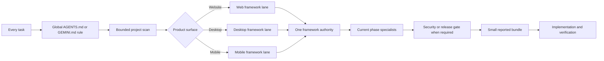
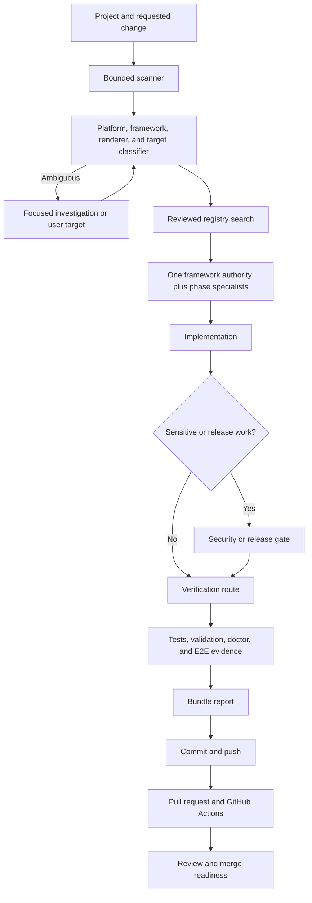

# Bundle Useful Skills

[](https://github.com/ammasyaa/bundle-useful-skills/actions/workflows/ci.yml)
[](LICENSE)

An open-source, dependency-free project scanner and router that gives Codex and Google Antigravity a small, compatible set of Agent Skills for each website, desktop, or mobile development task.

It keeps 48 installable capabilities available on each host while normally activating only two to five. Every report names the skills actually selected, every installed upstream copy points back to its creator, and every managed file is checked against its reviewed source.

## Contents

- [Start here](#start-here)
- [5W1H](#5w1h)
- [How routing works](#how-routing-works)
- [Supported development lanes](#supported-development-lanes)
- [Complete workflow](#complete-workflow)
- [Everyday commands](#everyday-commands)
- [Global installation](#global-installation)
- [Doctor and integrity model](#doctor-and-integrity-model)
- [End-to-end readiness](#end-to-end-readiness)
- [Contributor and GitHub workflow](#contributor-and-github-workflow)
- [Troubleshooting](#troubleshooting)
- [Pros and cons](#pros-and-cons)
- [Trust and update policy](#trust-and-update-policy)
- [Special thanks and original repositories](#special-thanks-and-original-repositories)
- [Repository map](#repository-map)
- [Contributing and security](#contributing-and-security)

## Start here

Requirements:

- Node.js 22 or later.
- Git and internet access for a full upstream installation.
- Windows, macOS, or Linux for the repository tools. Codex and Antigravity use their own supported platforms.

```bash
git clone https://github.com/ammasyaa/bundle-useful-skills.git
cd bundle-useful-skills
npm run test:e2e:quick
npm run install:global
npm run doctor
```

Restart Codex and Antigravity after installation so each host reloads its global instructions. A healthy full installation returns `ready: true` for both hosts.

For a release-quality check of the repository and a complete isolated installation:

```bash
npm run ready
```

## 5W1H

| Question | Answer |
|---|---|
| **What is it?** | A bounded project scanner, classifier, reviewed registry search, routing layer, installer, doctor, and E2E readiness gate for development Agent Skills. The registry contains 26 installable primary upstream skills, five official documentation authorities, and three internal bundle guides. Expo adds 22 required sibling skills, so a full host installation contains the router plus 48 capabilities. |
| **Why does it exist?** | Large skill collections can activate conflicting frameworks, duplicate design authorities, consume model context, and make it unclear which guidance was followed. This bundle selects one framework authority, adds only the specialists needed for the current phase, and reports that selection to the user. |
| **Who is it for?** | Developers and coding agents working on websites, Windows or macOS desktop applications, and Android or iOS mobile applications. It is especially useful for people who use both Codex and Antigravity or maintain several technology stacks. |
| **Where does it run?** | The router runs locally. Codex installs under `$CODEX_HOME/skills`, defaulting to `~/.codex/skills`; Antigravity installs under `~/.gemini/config/skills`. Host-wide routing instructions live in Codex's active global `AGENTS.md` and Antigravity's `~/.gemini/GEMINI.md`. |
| **When is it used?** | At the start of every task, whenever the platform, framework, or task phase changes, when sensitive features require the security gate, and before completion when verification is required. Non-development tasks receive a deterministic triage disclosure without loading development skills. |
| **How does it work?** | The global host rule consults `development-skill-router`. A bounded scan identifies project evidence before the router classifies product surface, framework, target, task phase, scope, database, and risks. It rejects incompatible combinations, chooses the smallest valid bundle, and emits real host invocation names plus selected and rejected reasons. |

## How routing works



The authority order is:

1. User requirements.
2. Security, privacy, and legal constraints.
3. Existing project architecture and approved project documents.
4. Platform conventions.
5. One framework authority.
6. Domain guidance such as databases or APIs.
7. Design, interaction, and review guidance.
8. Final filters such as anti-slop review.

A lower authority cannot silently override a higher one. React renderer guidance in Tauri or Electron applies only to renderer code. Design direction and final visual filters run as separate passes.

## Supported development lanes

| Product | Framework lanes | Target-aware guidance |
|---|---|---|
| Website | React, Next.js, web platform | Web accessibility, performance, design, APIs, Postgres, and Firebase |
| Desktop application | Flutter Desktop, Tauri, Electron, WinUI, native macOS | Windows or macOS conventions, renderer-specific React guidance, security, and release checks |
| Mobile application | Flutter, React Native, Expo, native iOS, native Android | iOS or Android design review, mobile performance, Expo/EAS tasks, release checks, and optional image references |

Flutter routes require an explicit compatible target because Flutter can produce desktop and mobile applications. Ambiguous multi-target repositories fail closed and ask for the intended product target.

## Complete workflow

The project separates evidence gathering, routing, execution, and proof so that each decision remains inspectable.



The components have deliberately narrow responsibilities:

| Component | Responsibility |
|---|---|
| Project scanner | Reads names and bounded metadata at depth two, skips dependency/build/cache/VCS directories, and never reports environment values or credentials. |
| Classifier | Infers platform, native shell, renderer, framework, and targets from evidence. A Tauri or Electron shell remains authoritative over its renderer. |
| Registry search | Compares the candidate route with reviewed metadata and reports selected skills, rejected near-matches, gaps, and conflicts. It does not install arbitrary search results. |
| Router | Enforces one framework authority, target requirements, security gates, conflicts, and the configured activation budget. |
| Installer | Stages pinned upstream sources, validates license evidence and filesystem boundaries, applies host policy, then performs collision-safe installation. |
| Doctor | Reports integrity and workflow readiness separately, including conditional host-tool gaps. |
| E2E runner | Installs into temporary homes, executes installed copies, checks both hosts, proves idempotency, detects tampering, and tests repair. |

The user workflow is: install, restart each host, run `doctor`, search the current repository, use or refine the proposed route, and review the bundle disclosure. Update or replacement remains explicit and backup-based. Codex installations technically set every managed capability to explicit-only invocation. Antigravity receives the same routing rule, but dormancy there is a policy-guided model behavior rather than a host-enforced exclusivity guarantee.

The agent workflow is: scan before classification, preserve the project’s existing architecture, select exactly one framework authority, load only the reported phase capabilities, re-route when the phase changes, add security or release gates when required, and route verification before claiming code or configuration complete. Ambiguous mixed targets stop routing until the intended product is known.

## Everyday commands

| Goal | Command |
|---|---|
| Search the current project and explain the route | `node scripts/cli.mjs search --root . --task implementation --description "add account sign-in"` |
| Human-readable skill report | `node scripts/cli.mjs report --platform mobile --framework flutter --task implementation --target ios` |
| Machine-readable JSON route | `node scripts/cli.mjs route --platform website --framework next --task implementation` |
| Detect a suggested lane from a file map | `node scripts/cli.mjs detect --file files.json` |
| Report non-development triage | `node scripts/cli.mjs triage` |
| Install both global hosts | `npm run install:global` |
| Inspect installation health | `npm run doctor` |
| Run fast repository checks | `npm run check` |
| Run offline dual-host smoke E2E | `npm run test:e2e:quick` |
| Run full isolated E2E | `npm run test:e2e` |
| Run the complete release gate | `npm run ready` |

Example database bug:

```bash
node scripts/cli.mjs report --platform mobile --framework flutter --target ios --task bug --scope database --database postgres
```

Example Tauri application with a React renderer:

```bash
node scripts/cli.mjs report --platform desktop --framework tauri --renderer react --target windows --task implementation
```

Use `--mode minimal`, `recommended`, or `full`. The mode changes the available selection budget; it never activates the entire inventory. Add comma-separated overrides with `--enable`, `--disable`, and `--risks`. Security capabilities required by sensitive work cannot be disabled.

The CLI is strict: unknown options, stray positional arguments, missing values, invalid booleans, and duplicate scalar options fail with a non-zero exit code. List options may be repeated and are merged. Framework authorities cannot be disabled, and target-scoped capabilities cannot be selected without a target.

## Global installation

The default command installs both hosts:

```bash
npm run install:global
```

Install one host when needed:

```bash
node scripts/install-global.mjs --target codex
node scripts/install-global.mjs --target antigravity
node scripts/doctor.mjs --target codex
node scripts/doctor.mjs --target antigravity
```

The installer:

- Fetches executable skills only from commits reviewed in `registry/skills.json`.
- Copies complete upstream skill directories into the selected host.
- Adds `BUNDLE_README.md` with creator, source, commit, and license attribution.
- Adds a `BUNDLE_SOURCE.json` manifest with an exact SHA-256 file inventory.
- Preserves host instructions outside the bundle's managed rule markers.
- Performs all collision checks and source staging before changing either host.
- Leaves current installations unchanged on repeat runs.
- Sets managed Codex capabilities to explicit-only invocation while preserving unrelated manifest fields.

This repository does not store third-party skill bodies. The explicit installer retrieves them from their original repositories when requested.

### Installation paths

| Host | Router and skill root | Global rule |
|---|---|---|
| Codex | `$CODEX_HOME/skills` or `~/.codex/skills` | Active `$CODEX_HOME/AGENTS.override.md` when non-empty; otherwise `$CODEX_HOME/AGENTS.md` |
| Antigravity | `~/.gemini/config/skills` | `~/.gemini/GEMINI.md` |

### Existing skills and safe migration

An unverified same-name capability stops installation. Preview the exact plan before replacing anything:

```bash
node scripts/install-global.mjs --target all --dry-run --replace-existing --adopt-legacy
```

Apply the reviewed plan:

```bash
node scripts/install-global.mjs --target all --replace-existing --adopt-legacy
```

- `--replace-existing` moves each old directory into a timestamped `bundle-useful-skills-backups` directory before installing the pinned copy.
- `--adopt-legacy` adds file hashes to a reviewed capability installed by an older bundle release.
- `--allow-existing` deliberately preserves an unverified skill. The doctor keeps that host at `ready: false` so the trust gap remains visible.
- `--router-only` installs the router and global rule without downloading the capability inventory.

The installer refuses incomplete or duplicate managed-rule markers and refuses to overwrite a modified or unrelated router.

## Doctor and integrity model

```bash
npm run doctor
```

The doctor emits one valid JSON array. A host is ready only when:

- The router exists, matches the current bundle version, and has an exact matching file inventory and hashes.
- Exactly one global managed-rule block exists and its content matches the repository template.
- All 48 capabilities match their reviewed commits, expected file names, and SHA-256 hashes.
- All unconditional skill dependencies required by installed workflows are present and valid.
- No capability is missing, stale, invalid, unverified, modified, or merely present from another installation.

`integrityReady` covers the router, rule, manifests, policies, files, and hashes. `workflowReady` covers unconditional capability dependencies. `conditionalGaps` names host tools that are needed only when a workflow reaches that branch, such as plan execution or delegated review. The combined `ready` value is true only when integrity and unconditional workflow requirements pass. A Codex capability with an invalid explicit-invocation policy is reported as `managed-policy-invalid`.

The hashes catch accidental changes and incomplete installations. They are not a cryptographic signature against an attacker who can rewrite both files and manifests.

## End-to-end readiness

Fast offline smoke test:

```bash
npm run test:e2e:quick
```

Complete plug-and-play release gate:

```bash
npm run ready
```

`npm run ready` performs:

1. All behavior and integration tests.
2. Registry and invocation-name validation.
3. License metadata and generated-attribution validation.
4. Local secret and privacy scanning.
5. A clean dual-host install in an isolated temporary home.
6. Ten route and search scenarios through the installed router copies.
7. Inspection of all 49 skill directories on each host and every upstream author attribution file.
8. A repeat installation proving idempotency.
9. Intentional test-copy tampering and required doctor rejection.
10. Backup-based repair followed by final readiness for both hosts.

The E2E runner never writes to the real user profile. Successful runs clean up automatically. Failed runs print and retain the temporary home for diagnosis. Pass `--cleanup-on-failure` to remove failed-run data or `--keep-temp` to retain a successful test home.

GitHub Actions runs repository checks and the quick isolated E2E on Ubuntu, Windows, and macOS. A dependent Ubuntu job then runs the full networked isolated installation. This split catches operating-system path and symlink behavior without downloading the complete upstream inventory three times.

## Contributor and GitHub workflow

Use a focused branch and write the boundary test before changing routing behavior:

```bash
git clone https://github.com/ammasyaa/bundle-useful-skills.git
cd bundle-useful-skills
git switch -c codex/describe-the-change
npm ci
node --test tests/the-relevant-test.test.mjs
# Make the smallest implementation and documentation change.
node scripts/generate-credits.mjs
npm run check
npm run test:e2e:quick
git diff --check
git add <reviewed-files>
git commit -m "Describe the behavior change"
git push -u origin codex/describe-the-change
gh pr create --fill
```

A pull request should explain the trigger, old and new route, authority choice, security impact, upstream evidence when applicable, and exact verification commands. Registry changes must identify the canonical repository, exact skill path, reviewed commit, repository-level license or notice evidence, and regenerated credits. Do not commit research scratchpads, credentials, caches, machine-specific paths, or copied third-party skill bodies.

Merge readiness requires all matrix jobs and the full E2E job to pass, focused review comments to be resolved, generated attribution to be current, and the pull request diff to contain no unrelated files. Do not merge a red build or bypass a failed operating-system job as “platform noise”; reproduce it or document why that platform is no longer supported.

For a release, update the package version and user-facing history, run `npm run ready` from a clean checkout, inspect `npm run doctor` output from the isolated E2E, confirm the registry and generated credits, obtain review, merge through GitHub, then create the intended signed or annotated tag and release notes. Publishing a release or tag is a separate maintainer action; passing CI alone does not publish anything.

More detail: [getting started](docs/getting-started.md), [architecture](docs/architecture.md), [skill routing](docs/skill-routing.md), [adding a skill](docs/adding-a-skill.md), [attribution](docs/attribution.md), and [contribution rules](CONTRIBUTING.md).

## Troubleshooting

| Symptom | Meaning and next action |
|---|---|
| Search returns `needsInput` | Evidence names multiple product targets or cannot establish one authority. Pass an explicit platform/framework/target after checking the relevant entry point. |
| `Unknown option` or duplicate option error | The CLI rejected a typo or ambiguous scalar. Correct the option; use repeated values only for supported list flags. |
| Doctor reports modified, stale, or unverified files | Review the diff and source manifest. Use a dry run before the explicit backup-based replacement flow; do not overwrite unknown work. |
| Doctor reports `managed-policy-invalid` | A managed Codex capability is no longer explicit-only. Re-run the installer for the reviewed copy or inspect the manifest before replacement. |
| `workflowReady` is false | An unconditional capability dependency is absent. Install the full reviewed inventory and run doctor again. Conditional gaps are informational until that workflow branch is used. |
| Upstream clone or license validation fails | Keep the current installation. Confirm network access and the reviewed commit/license evidence; never weaken the check to force an install. |
| One CI operating system fails | Reproduce with Node.js 22 on that OS. Check path separators, case handling, permissions, symlinks, and cleanup before changing the assertion. |
| A failed E2E retained a temporary home | Inspect the printed path. Re-run with `--cleanup-on-failure` only when the retained evidence is no longer needed. |

## Pros and cons

| Pros | Cons and trade-offs |
|---|---|
| Selects a small task-specific bundle instead of loading every installed skill. | Host instruction-following is strong guidance rather than a mathematical guarantee. Review the bundle disclosure and verification evidence. |
| Prevents incompatible framework authorities from being selected together. | The router intentionally supports website, desktop, and mobile development; unrelated work receives triage only. |
| Supports Codex and Antigravity with one registry and one installation command. | A full install creates 49 directories per host and requires Git plus internet access. Use `--router-only` for a smaller setup. |
| Pins executable upstream sources and checks exact files with SHA-256 hashes. | Pinned guidance can age. Current official framework documentation remains authoritative when APIs change. |
| Preserves local host rules and backs up replaced same-name skills. | Replacing an existing skill requires an explicit reviewed migration command. This adds a deliberate safety step. |
| Reports real invocation names, reasons, references, warnings, and conflicts. | Ambiguous Flutter or multi-target projects require an explicit target before routing can continue. |
| Adds security and release gates when task risks require them. | Registry quality depends on continued review of upstream licenses, commits, behavior, and maintenance. |
| Keeps the router dependency-free and provides offline fast tests. | Full E2E tests depend on public upstream repositories being reachable. |
| Includes complete creator, repository, commit, license, and notice records. | A very large unrelated global skill collection can still pressure a host's initial metadata budget. |
| Runs cross-platform checks plus an isolated full installation in CI. | Antigravity dormancy is policy-guided because that host has no equivalent manifest-level exclusivity control. Restart it after installation. |

## Trust and update policy

Registry trust labels have specific meanings:

| Label | Meaning |
|---|---|
| `official` | Published by the framework, platform, or product owner. |
| `verified` | Community or vendor work whose identity, source, license evidence, and pinned commit were reviewed. |
| `community` | Useful community guidance that needs stronger project-specific judgment. |
| `experimental` | Promising upstream workflow that requires additional release verification. |
| `internal` | Original MIT-licensed guidance maintained in this repository. |

Popularity is not a trust level. New upstream entries must include repository identity, exact skill path, license evidence, and a reviewed commit. Registry changes must regenerate the attribution files and pass `npm run ready`.

Technical source records are available in [`THIRD_PARTY_SKILLS.md`](THIRD_PARTY_SKILLS.md). Individual attribution cards live in [`catalog/`](catalog/), and the grouped acknowledgment record is [`CREDITS.md`](CREDITS.md).

## Special thanks and original repositories

This project exists because skill authors, framework teams, and documentation communities published work that others can learn from and build upon. Special thanks to every creator and maintainer listed below. Their original projects remain authoritative, and inclusion here does not imply endorsement, sponsorship, partnership, or affiliation.

### Installable upstream skills

| Creator or maintainer | Skills used by this bundle | Original repository | License |
|---|---|---|---|
| Jesse Vincent / obra | `brainstorming`, `writing-plans`, `test-driven-development`, `systematic-debugging`, `requesting-code-review`, `verification-before-completion` | [obra/superpowers](https://github.com/obra/superpowers) | MIT |
| The Flutter Authors | `flutter-apply-architecture-best-practices` | [flutter/agent-plugins](https://github.com/flutter/agent-plugins) | BSD-3-Clause |
| The Dart Authors | `dart-run-static-analysis` | [dart-lang/skills](https://github.com/dart-lang/skills) | BSD-3-Clause |
| Vercel | `vercel-react-best-practices`, `vercel-composition-patterns`, `web-design-guidelines`, `vercel-react-native-skills` | [vercel-labs/agent-skills](https://github.com/vercel-labs/agent-skills) | MIT |
| Expo | `expo-overview`, `expo-native-ui`, and the 22 Expo/EAS dependencies below | [expo/skills](https://github.com/expo/skills) | MIT |
| Microsoft | `winui-dev-workflow` | [microsoft/win-dev-skills](https://github.com/microsoft/win-dev-skills) | MIT; upstream notices preserved |
| Paul Bakaus | `impeccable` | [pbakaus/impeccable](https://github.com/pbakaus/impeccable) | Apache-2.0; upstream notice preserved |
| Emil Kowalski | `emil-design-eng` | [emilkowalski/skills](https://github.com/emilkowalski/skills) | MIT |
| Miqdad Badjuber | `antislop` | [miqdadbadjuber/anti-slop](https://github.com/miqdadbadjuber/anti-slop) | MIT |
| nextlevelbuilder | `ui-ux-pro-max` | [nextlevelbuilder/ui-ux-pro-max-skill](https://github.com/nextlevelbuilder/ui-ux-pro-max-skill) | MIT |
| Leon Zhang | `design-taste-frontend`, `imagegen-frontend-mobile` | [Leonxlnx/taste-skill](https://github.com/Leonxlnx/taste-skill) | MIT |
| Anthropic | `frontend-design` | [anthropics/skills](https://github.com/anthropics/skills) | Apache-2.0 |
| wshobson | `mobile-ios-design`, `mobile-android-design` | [wshobson/agents](https://github.com/wshobson/agents) | MIT |
| Supabase | `supabase-postgres-best-practices` | [supabase/agent-skills](https://github.com/supabase/agent-skills) | MIT |
| Google Firebase | `firebase-basics` | [firebase/agent-skills](https://github.com/firebase/agent-skills) | Apache-2.0 |

<details>
<summary><strong>Expo's 22 installed sibling skills</strong></summary>

Thank you to Expo and its contributors for maintaining the complete family used by the Expo router:

`eas-app-stores`, `eas-hosting`, `eas-observe`, `eas-simulator`, `eas-update-insights`, `eas-update`, `eas-workflows`, `expo-animation`, `expo-app-clip`, `expo-brownfield`, `expo-data-fetching`, `expo-design-system`, `expo-dev-client`, `expo-dom`, `expo-examples`, `expo-module`, `expo-project-structure`, `expo-router`, `expo-skill-feedback`, `expo-ui`, `expo-upgrade`, and `expo-web-to-native`.

All are installed from the reviewed commit recorded for [expo/skills](https://github.com/expo/skills).

</details>

### Official documentation authorities

These entries are live references rather than copied skills, allowing current official documentation to control changing APIs.

| Creator or community | Guidance used | Original repository or documentation |
|---|---|---|
| Tauri Programme within The Commons Conservancy | `tauri-docs`: architecture, implementation, security, and release guidance | [tauri-apps/tauri-docs](https://github.com/tauri-apps/tauri-docs) |
| OpenJS Foundation and Electron contributors | `electron-docs`: architecture, implementation, security, and release guidance | [electron/electron](https://github.com/electron/electron) |
| Apple Inc. | `apple-docs`: Apple Human Interface Guidelines and platform guidance | [Apple Human Interface Guidelines](https://developer.apple.com/design/human-interface-guidelines/) |
| Google | `android-docs`: Android design and developer guidance | [Android Developers](https://developer.android.com/) |
| Mozilla and contributors | `web-platform-docs`: web-platform, accessibility, and performance guidance | [MDN Web Docs](https://developer.mozilla.org/) |

### Bundle-maintained guidance

Thank you to the **Bundle Useful Skills contributors** who maintain `development-skill-router`, `api-design`, `security-gate`, `release-gate`, compatibility rules, installer, doctor, tests, and attribution system in [this repository](https://github.com/ammasyaa/bundle-useful-skills). This original project code is MIT-licensed.

## Repository map

| Path | Purpose |
|---|---|
| [`router/SKILL.md`](router/SKILL.md) | Compact routing instructions loaded by compatible hosts. |
| [`router/references/`](router/references/) | Platform, API, security, and release guidance loaded only when needed. |
| [`registry/skills.json`](registry/skills.json) | Source, author, license, compatibility, authority, and trust metadata. |
| [`registry/invocations.json`](registry/invocations.json) | Mapping from internal registry IDs to real host invocation names. |
| [`profiles/index.json`](profiles/index.json) | Supported product and framework lanes. |
| [`src/router.mjs`](src/router.mjs) | Dependency-free routing and validation engine. |
| [`src/project-scanner.mjs`](src/project-scanner.mjs) | Bounded, secret-safe repository evidence collection. |
| [`src/project-classifier.mjs`](src/project-classifier.mjs) | Platform, framework, shell, renderer, and target inference. |
| [`src/registry-search.mjs`](src/registry-search.mjs) | Reviewed capability selection and rejection explanations. |
| [`src/search.mjs`](src/search.mjs) | Project-search orchestration and human-readable report. |
| [`scripts/install-global.mjs`](scripts/install-global.mjs) | Safe global installer for Codex and Antigravity. |
| [`scripts/doctor.mjs`](scripts/doctor.mjs) | Installation, rule, version, inventory, and hash diagnostics. |
| [`scripts/e2e.mjs`](scripts/e2e.mjs) | Isolated plug-and-play readiness journey. |
| [`catalog/`](catalog/) | One generated attribution card per external registry entry. |
| [`adapters/`](adapters/) | Host-specific integration notes. |

## Contributing and security

Read [`CONTRIBUTING.md`](CONTRIBUTING.md) before changing routing or registry metadata. Behavior changes require tests, upstream additions require provenance and license review, and registry changes require regenerated credits.

Report security concerns according to [`SECURITY.md`](SECURITY.md). Do not include credentials, private project data, or exploit details in public issues.

The original findings are in [`docs/audit-2026-09-05.md`](docs/audit-2026-09-05.md); the v0.4 remediation report and remaining limitations are in [`docs/audit-2026-09-06.md`](docs/audit-2026-09-06.md).

## License

The original router, installer, tests, and documentation in this repository are licensed under the [MIT License](LICENSE). Third-party projects retain their own licenses. Their instructions are fetched from original sources only during explicit installation and remain governed by their upstream terms.
