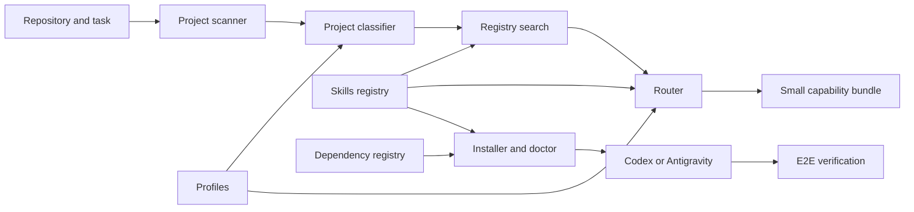

# Architecture

Bundle Useful Skills is a dependency-free Node.js 22 control plane for development Agent Skills. It does not execute application code and does not silently install third-party guidance. Its job is to gather safe project evidence, select a compatible route, install reviewed capabilities when explicitly requested, and prove that the installation remains usable.

## Component boundaries

| Layer | Files | Contract |
|---|---|---|
| Search | `src/project-scanner.mjs`, `src/project-classifier.mjs`, `src/registry-search.mjs`, `src/search.mjs` | Collect bounded non-secret evidence, infer a candidate lane, and explain selected and rejected reviewed skills. |
| Policy | `router/SKILL.md`, `rules/global-rule.md` | Make routing discoverable on every task and define when agents scan, route, re-route, and verify. |
| Profiles | `profiles/index.json` | Declare supported platform/framework lanes, compatible targets, and exactly one mandatory framework authority per lane. |
| Registry | `registry/skills.json`, `registry/invocations.json`, `registry/dependencies.json` | Record compatibility, real host names, provenance, license evidence, reviewed commits, conflicts, and workflow dependencies. |
| Router | `src/router.mjs`, `src/security-signals.mjs`, `src/compatibility.mjs` | Validate explicit input, preserve the authority, require targets, add mandatory gates, enforce activation budgets, and return a task-scoped plan. |
| Installation | `scripts/install-global.mjs`, `src/safe-tree.mjs`, `src/openai-policy.mjs` | Validate registry data before mutation, stage safe regular files, reject boundary escapes, require license evidence, handle collisions, and apply host policy. |
| Health | `scripts/doctor.mjs`, `src/dependencies.mjs` | Separate file/policy integrity from unconditional workflow readiness and list conditional tool gaps. |
| Proof | `scripts/e2e.mjs`, `tests/` | Exercise repository behavior and installed copies in isolated temporary homes, including tamper detection and repair. |

## Decision authority

The authority order is user requirements, security/privacy/legal constraints, existing architecture and approved project documents, platform conventions, one framework authority, domain guidance, design/interaction/review guidance, and final filters. A lower layer cannot silently override a higher one.

Product platform is classified before task type. A desktop native shell remains the framework authority even when its renderer uses React. Renderer guidance is scoped to renderer files. Flutter and every target-scoped capability require a compatible explicit target when project evidence does not identify exactly one.

## Search and privacy boundaries

The scanner visits at most two directory levels and 1,000 entries. It skips dependency, build, cache, and version-control trees. It records manifest names, declared package names, relevant directory names, repository instructions, documentation signals, and safe Git metadata. It does not read or return environment-variable values, credential values, arbitrary source bodies, or ignored dependency contents.

Classification is evidence-backed, not a replacement for explicit user intent. Native-shell evidence outranks renderer evidence. Conflicting product lanes or multiple unresolved targets produce `needsInput`; the classifier does not choose whichever signal appeared first.

## Discovery, dormancy, and activation

Guaranteed router discovery and task-specific capability loading are separate concerns. A managed global rule puts `development-skill-router` in every task's instruction chain. The router then reports a small phase-specific bundle using each upstream skill's actual invocation name.

For Codex, the installer also sets `policy.allow_implicit_invocation: false` in every managed capability's `agents/openai.yaml`, preserving unrelated upstream metadata. The doctor verifies this field. Antigravity has no equivalent manifest-level exclusivity mechanism in this project, so its dormant-inventory behavior is policy-guided and must not be described as technically enforced.

## Reproducibility and trust

Executable upstream skills are fetched only by the explicit installer from reviewed commits. The installer checks canonical registry metadata, safe source paths, repository-level license or notice evidence, regular-file boundaries, and an exact SHA-256 file inventory. It adds attribution without editing upstream instructions invisibly. Current official documentation remains authoritative for APIs that changed after the reviewed commit.

The integrity hashes detect accidental drift and incomplete installations. They are not signatures against an attacker who can rewrite both content and manifests.

## Readiness semantics

`integrityReady` means the router, managed rule, capability source manifests, hashes, and Codex policy are current. `workflowReady` means every unconditional required skill dependency is installed and valid. `conditionalGaps` lists host tools needed only when a particular workflow branch is entered. `ready` is true only when integrity and unconditional workflow dependencies pass.

The quick E2E uses router-only fixtures for cross-platform offline behavior. The full E2E downloads the pinned inventory into isolated homes, verifies all installed directories and attribution, repeats installation, tampers with a test copy, requires doctor rejection, repairs through the backup flow, and requires final readiness.
